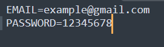

# Auto Zaka

## **EN:**

Bot that automates participation in giveaways for the site https://zaka-zaka.com/

## Table of Contents:

- [Features](#Features)
- [Requirements](#Requirements)
- [Installation](#Installation)
- [Usage](#Usage)
- [Planned functionality](#Planned-functionality)
- [Acknowledgements](#Acknowledgements)

## Features:

- Complete automation of the participation process.
- Proxy support **(Incomplete support)**
- Support "Happy Hour" parsing with Steam price output
- Cookie authorization
- Data validation
- System tray
- Configuration and logging
- Support autostart with Windows

## Requirements:

[**FFmpeg**](https://www.wikihow.com/Install-FFmpeg-on-Windows)

This is related to a script for solving captchas during login/password authorization that uses this dependency.

## Installation:

**1. Clone the Repository:**

```bash
git clone https://github.com/xxqqwua/Steam_Games_Price_Parser
cd Steam_Games_Price_Parser
```

**2. Install Dependencies:**

```bash
pip install -r requirements.txt
```

**3. Compile app:**

```bash
pyinstaller --onefile --noconsole --hidden-import pkg_resources --add-data "requirements.txt;." --name AutoZaka main.py
```

**4. Use the .exe that will be in the "dist" folder**

**OR**

Download the already finished, compiled, file at [_**here**_](https://github.com/xxqqwua/AutoZaka/releases);
<br> Or directly to the file itself via
[**_link_**](https://github.com/xxqqwua/AutoZaka/releases/download/v1.0.0/AutoZaka.exe).

## Usage:

**You need to have an internet connection for the app to work.**

At the first launch the app will create a directory “AutoZaka” in your documents folder. In this directory are
stored all the necessary files for the app:\
<br> **.env** - which should store your login/password data from the site;
<br> **app.log** - a file with logs; 
<br> **cookies.json** - a file with cookies, for quick interaction with the site.\
<br> **Files from this directory are very important for working with the app. 
<br> Their deletion, moving or unauthorized modification can cause
the app to become unusable.** 

First of all, after launching, the app will ask you to fill in the .env file. The app will open two windows where you need to enter your **email** and **password**.

**Here's example of what the .env file should look like:**\


After launching, the app will understand that there are no cookies yet and will auth to the site **by using your data**.
<br>After a successful login, a **cookie.json** file will be created.

While the app is running, you will see an icon of Zaka-Zaka online store in the system tray. If you right-click on
it, you will see a context menu with the following items:\
<br> **“Happy Hour”** - check the current games on the ‘Happy Hour’ page of the Zaka-Zaka website, if possible, the price from Steam will be displayed;
<br> **Open log/.env** - opens files corresponding to the name for quick editing, viewing; 
<br> **AutoStartUp** - has two values: with a checkmark and without, with a checkmark means that the app will run when you turn on Windows, if there is no checkmark, then the app is not in
the autoloader. By clicking on AutoStartUp with the left mouse button you will either have or remove the app from
autostartup.
<br> **Exit** - app is fully closed.

**All actions and possible errors can be tracked in the logs.**

## Planned functionality:

- Make full support for proxies
- Adapt the app to multiple accounts

## Acknowledgements:

- CAPTCHA bypass logic is based on an external solution by [obaskly](https://github.com/obaskly/RecaptchaBypass), which helped handle automated solving.
- Steam price parsing is done using my own pre-existing script, available at [GitHub Repository](https://github.com/xxqqwua/Steam_Games_Price_Parser).

## **<br>RU:**

Бот, который автоматизирует участие в розыгрышах на сайте https://zaka-zaka.com/

## Содержание:
- [Возможности](#Возможности)
- [Требования](#Требования)
- [Установка](#Установка)
- [Использование](#Использование)
- [Планируемый функционал](#Планируемый-функционал)
- [Благодарности](#Благодарности)

## Возможности:
- Полная автоматизация процесса участия
- Поддержка прокси **(Неполная поддержка)**
- Поддержка парсинга "Happy Hour" с выводом цен Steam
- Авторизация через cookies
- Валидация данных
- Системный трей
- Конфигурация и логирование
- Поддержка автозапуска с Windows

## Требования:
[**FFmpeg**](https://www.wikihow.com/Install-FFmpeg-on-Windows) 

Это связано со скриптом для решения капчи при авторизации логин/пароль, который использует эту зависимость.

## Установка:
**1. Клонируйте репозиторий:**

```bash
git clone https://github.com/xxqqwua/Steam_Games_Price_Parser
cd Steam_Games_Price_Parser
```

**2. Установите зависимости:**
```bash
pip install -r requirements.txt
```

**3. Скомпилируйте приложение:**
```bash
pyinstaller --onefile --noconsole --hidden-import pkg_resources --add-data "requirements.txt;." --name AutoZaka main.py
```

**4. Используйте .exe файл, который будет в папке "dist"**

**ИЛИ**

Скачайте уже готовый, скомпилированный файл [**здесь**](https://github.com/xxqqwua/AutoZaka/releases); <br> Или напрямую к самому файлу по [**ссылке**](https://github.com/xxqqwua/AutoZaka/releases/download/v1.0.0/AutoZaka.exe).

## Использование:
**Для работы приложения необходимо подключение к интернету.**

При первом запуске приложение создаст директорию "AutoZaka" в папке ваших документов. В этой директории хранятся все необходимые файлы для приложения:\
<br>
**.env** - должен хранить ваши данные логин/пароль с сайта; <br>
**app.log** - файл с логами; <br>
**cookies.json** - файл с cookies для быстрого взаимодействия с сайтом.\
<br>
**Файлы из данной директории очень важны для работы с приложением. <br>
Их удаление, перемещение или несанкционированное изменение может привести к неработоспособности приложения.**

В первую очередь, после запуска, приложение попросит вас заполнить .env файл. Прежде всего, после запуска приложение попросит вас заполнить файл .env. Приложение откроет два окна, в которых вам нужно будет ввести **почту** и **пароль**.

**Пример того, как должен выглядеть файл .env:**\


После запуска приложение поймет, что cookies еще нет, и выполнит авторизацию на сайте **используя ваши данные**. <br>После успешного входа будет создан файл **cookie.json**.

Пока приложение работает, вы увидите иконку интернет-магазина Zaka-Zaka в системном трее. Если щелкнуть по ней правой кнопкой мыши, вы увидите контекстное меню со следующими пунктами:\
<br>
**"Happy Hour"** - проверить текущие игры на странице 'Happy Hour' сайта Zaka-Zaka, по возможности будет отображена цена из Steam; <br>
**Open log/.env** - открывает файлы, соответствующие названию, для быстрого редактирования, просмотра; <br>
**AutoStartUp** - имеет два значения: с галочкой и без, с галочкой означает, что приложение будет запускаться при включении Windows, если галочки нет, то приложение не в автозагрузке. Кликнув по AutoStartUp левой кнопкой мыши, вы либо добавите, либо удалите приложение из автозапуска. <br>
**Exit** - приложение полностью закрывается.

**Все действия и возможные ошибки можно отследить в логах.**

## Планируемый функционал:
- Сделать полную поддержку прокси
- Адаптировать приложение под несколько аккаунтов

## Благодарности:

- Обход CAPTCHA реализован на основе стороннего решения от [obaskly](https://github.com/obaskly/RecaptchaBypass), использованного для автоматизации распознавания.
- Парсинг цен из Steam выполнен с использованием моего ранее написанного скрипта — репозиторий доступен здесь: [GitHub Repository](https://github.com/xxqqwua/Steam_Games_Price_Parser).
